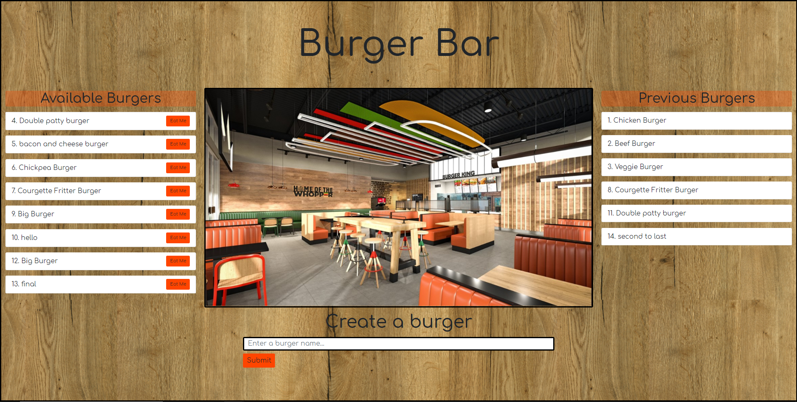

# Burger Bar - Model View Controlled

## Description 

This application is designed to let users input the names of burgers they would like to eat. Whenever a use submits a burger's name, the app will display the burger under Available burgers. Each burger in this queue also has an 'Eat Me' button; when the user clicks it, the burger will move to the previous burger list. These burgers are all stored in the data base with a 'deveoured' status. 



This burger logger is created with MySQL, Node, Express, Handlebars and a homemade ORM. It follows the MVC design pattern; uses Node and MySQL to query and route data in the app, and Handlebars to generate the HTML.

The application is fully responsive. 

I have been through the full handlebars namual and npm instructions to learn how to use handlebars, there is more functionality that i would like to experiment with as a consequence, this application uses the basic built in helpers each and if to seperate the devoured status of the burgers. 

I have also spent alot of time with express and the routing system to better learn how to ustilise the models and "factory" systems in coding. 

I have learnt how to use enviromental process and properties through .env to hide important secret data from the general public. 

## Contents

1. [Installation](#Instalation) 
2. [Usage](#Usage)
3. [Improvements](#Improvements)
4. [Updates](#Updates)
5. [Credits](#Credits)
6. [License](#License)
7. [Contact](#Contact)

## Installation. 

1. Once you have pulled the repo onto your computer you will need to create and set up your own database. There is a .env.example file to explain the data you will need to fill in your own .env file. 

2. There are a number of dependencies to this application that you will need to install 
    Using ``` >npm init ``` to initalise the use of npm modules you will also need to install the following using the command line ``` > npm install <dependency name> ```

#### Dependencies:

* Dotenv
* Express
* MyQql
* Express Handlebars

    I also have sequilize and nodemon attached to my project although i have not utilised sequelize on this occation. 

#### Technoligies used: 

* HTML
* CSS 
* Javascript
* Express 
* Express handlebars 
* Node.js 
* MySql 
* Heroku 
  

## Usage 

1. To use the application you will need to run ``` >node server ``` from your command line and open the port you are using.    
    Alternitively there is a [Heroku link]() for you to see the application running. 

2. Use the create a burger input field to name your burger. this will display to the right or in available burgers if you are in a different responsive view. 

3. Click the 'Eat Me' button to eat your burger. It will display in the previous burgers list. 

    It is not a complex application. 

## Improvements 

I would like to add a delete feature for burgers if the burgers are removed but not eaten; such as the real life situation that a product goes past sell by date. 

I would like to add a restriction to the number of burgers in the available burgers so you have to eat some product before you can create more. 

I would like to add a counter to the Previous burgers list so that if more burgers of the same name are added and eaten it shows a counted total rather than repetitions in this list. 

## Updates

There are no updates at this time. 

## Credits 

[](https://saythanks.io/to/kennethreitz)
Thanks go to:
 * Colum Lynagh - For helping me at moist stages of this project to untangle the routing and handlebars. There were a number of complex errors i would not have solved without his help. 

Resources I have referenced:   
* W3Schools
* Stackoverflow
* Postman
* npmjs.com/package/express-handlebars
* Handlebarsjs.com
* Sequelize.org
* Expressjs.com


## License 

* GNU GPL v3 

Where appropriate: 
Alot of the graphics included in my projects I have drawn myself and are copyright 2020. 
No useage without permission please. 
If I have not originated the imagery I have gained the permission of the owner and acreditied 
where necessary. These are also not for re-purpose without permission of the owner.

You must make reference where the code originated. I would also love to see what changes and improvements you make.  
Design by Samantha Wakelam, please respect copyright 2020. 


## Contact

* Name: Samantha Wakelam  <br />Email: sam.wakelam@hotmail.co.uk <br />Github Profile: Sam Wakelam 

    There is a link to the project on my portfolio page, please [check it out]().